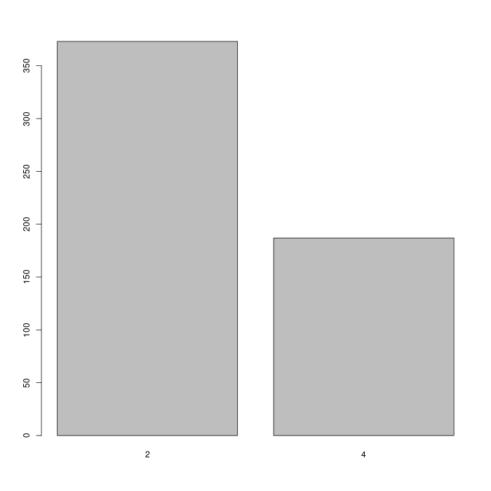
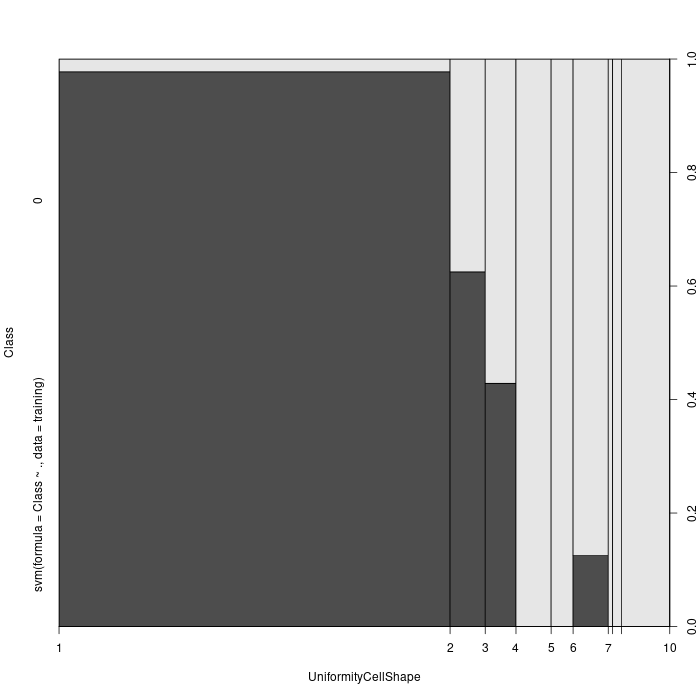
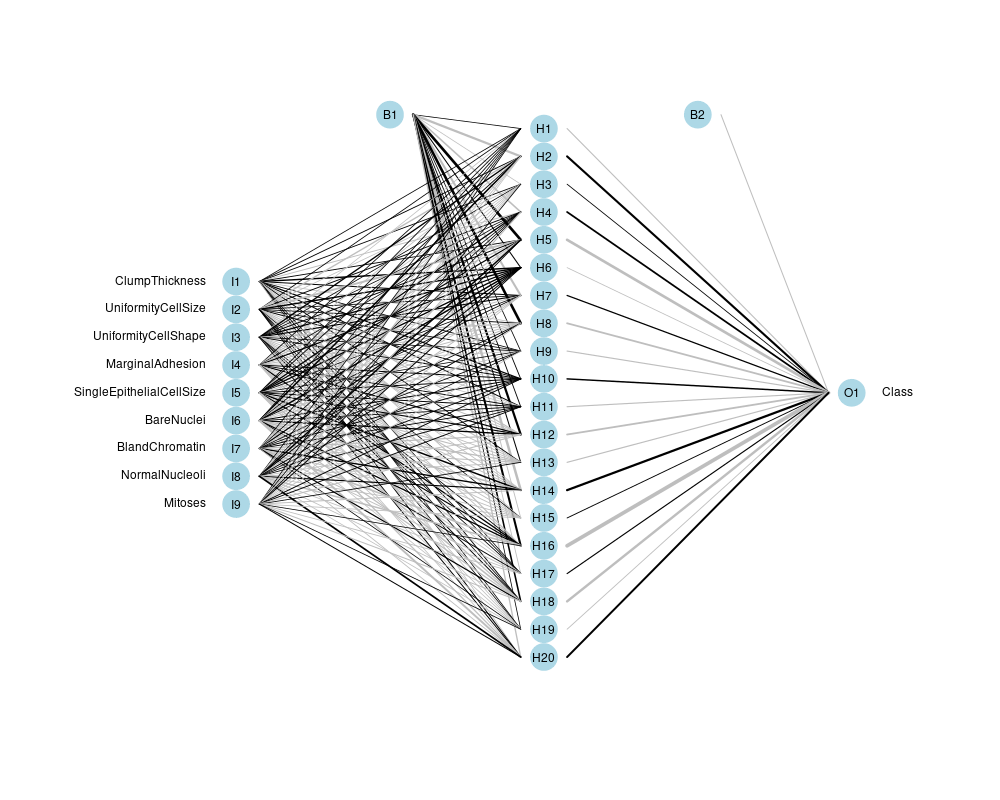
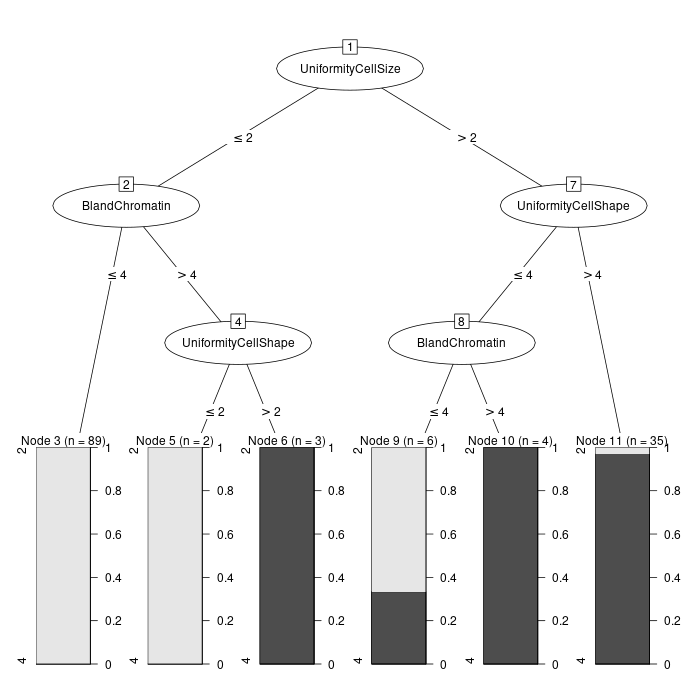

# Goal
This repository illustrates my attempts to train various machine learning
algorithms on the famous wisconsin breast cancer data set. Successful fitted models
with +90% accuracy include:
+ K Nearest Neighbours
+ Support Vector Machines
+ Single Layer Neural Network (surprisingly the least accurate)
+ C5.0 Decision Tree

## K Nearest Neighbours
|     |     2 |    4 |
| ___ | _____ |  ___ |
|   2 |   356 |    8 |
| ___ |  ____ | ____ |
|   4 |    17 |  179 |

25 mistakes out of 560 data points. 0.9553571 accuracy.
## Support Vector Machine
|     |   2 |     4 |
| ___ | ___ |    __ |
|   2 | 348 |    16 |
| ___ | ___ | _____ |
|   4 |  10 |   186 |
26 Mistakes out 560. 0.9535714 accuracy. Roughly the same as K nearest neighbours.

Note that this graph only shows the division as a function of only 1 factor. In
reality, the division is an n-dimensional hyperplane.

## Neural Network
|     |   2 |     4 |
| ___ | ___ | _____ |
|   2 | 349 |    17 |
|   4 |  16 |   178 |
0.9410714 accuracy. Slightly worse than the other two models.

## C5.0 Decision Tree

|     |   2 |    4 |
| ___ | ___ |  ___ |
|   2 | 357 |   14 |
| ___ |  __ | ____ |
|   4 |   9 |  180 |
0.9678571 accuracy. Best model so far.

## Author
Cristian Groza
